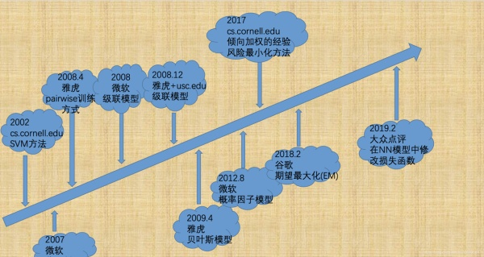

## Papers
推荐系统有两个bias，一个是position bias，另一个是向用户展示的商品列表是由上一版本的推荐系统决定的。

- Huawei. PAL: a position-bias aware learning framework for CTR prediction in live recommender systems
- Bing. Model Ensemble for Click Prediction in Bing Search Ads
- Google. Learning to Rank with Seleposition_bias_history.jpgction Bias in Personal Search